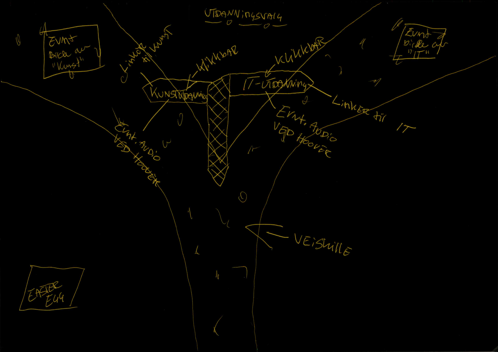

[Open the website](https://blackcapcoder.github.io/future-webproj/forside.html)

# Gjennomføringsplan

## Auftragstaktikk

"In mission-type tactics, the military commander gives subordinate leaders a clearly defined goal (the mission), the forces needed to accomplish that goal and a time frame within which the goal must be reached. The subordinate leaders then implement the order independently. The subordinate leader is given, to a large extent, the planning initiative and a freedom in execution which allows a high degree of flexibility at the operational and tactical levels of command. Mission-type orders free the higher leadership from tactical details."

- Fra Wikipedia

Gruppen har bestemt å fordele arbeidsoppgavene i små grupper i to og to. Vi gjør dette med å et felles mål, men veien ditt bestemmes med stor frihet av undergruppene. Til slutt går vi sammen og legger all kode til en fil.

### Arbeidsplan
Møtes på skolen kl 12 hverdag og jobbe til  kl 14-16. Her møtes vi og finner en plass hvor vi kan kode. Underveis vil vi dele, diskutere og hjelpe hverandre med kodene.

Vi deler koden på Github slik at vi kan oppnå bedre samarbeid og tilgang på filene. 

### Gjennomførtbart
Vi anser dette som gjennomførtbart da vi har klart dette hver dag i uken før.
Gruppens samhold og kommunikasjon blir bedre og bedre.

# Første utkast

# Skisse Grunder

# Skisse Jobb

# Skisse Utdanning

# Struktur

# Arbeidsfordeling

