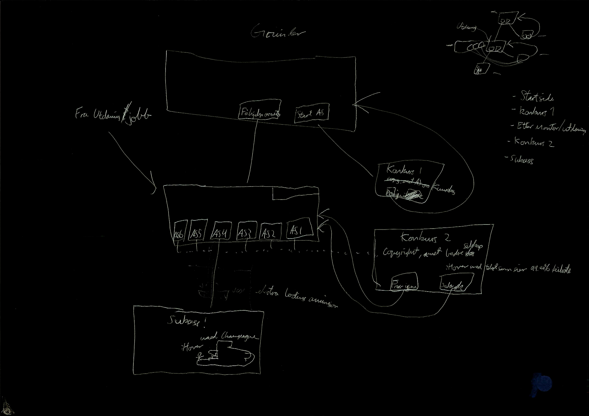

[Open the website](https://blackcapcoder.github.io/future-webproj/forside.html)

# Gjennomføringsplan

## Auftragstaktikk

Gruppen har bestemt å fordele arbeidsoppgavene i små grupper i to og to. Vi gjør dette med å et felles mål, men ditt bestemmes med stor frihet av undergruppene. Til slutt går vi sammen og legger all kode til en fil.

### Arbeidsplan
Møte på skolen kl 12 hverdag og jobbe til  kl 14-16. Her møtes vi og planlegger agendaen for dagen før vi går hver undergruppe og kode. Møtes sammen til slutt hvor vi vil dele, diskutere og hjelpe hverandre med kodene.

Vi deler koden på Github slik at vi kan oppnå bedre samarbeid og tilgang på filene. 

### Gjennomførtbart
Vi anser dette som gjennomførtbart da vi har klart dette hver dag i uken før.
Gruppens samhold og kommunikasjon blir bedre og bedre.

# Første utkast

# Skisse Grunder

# Skisse Jobb

# Struktur

